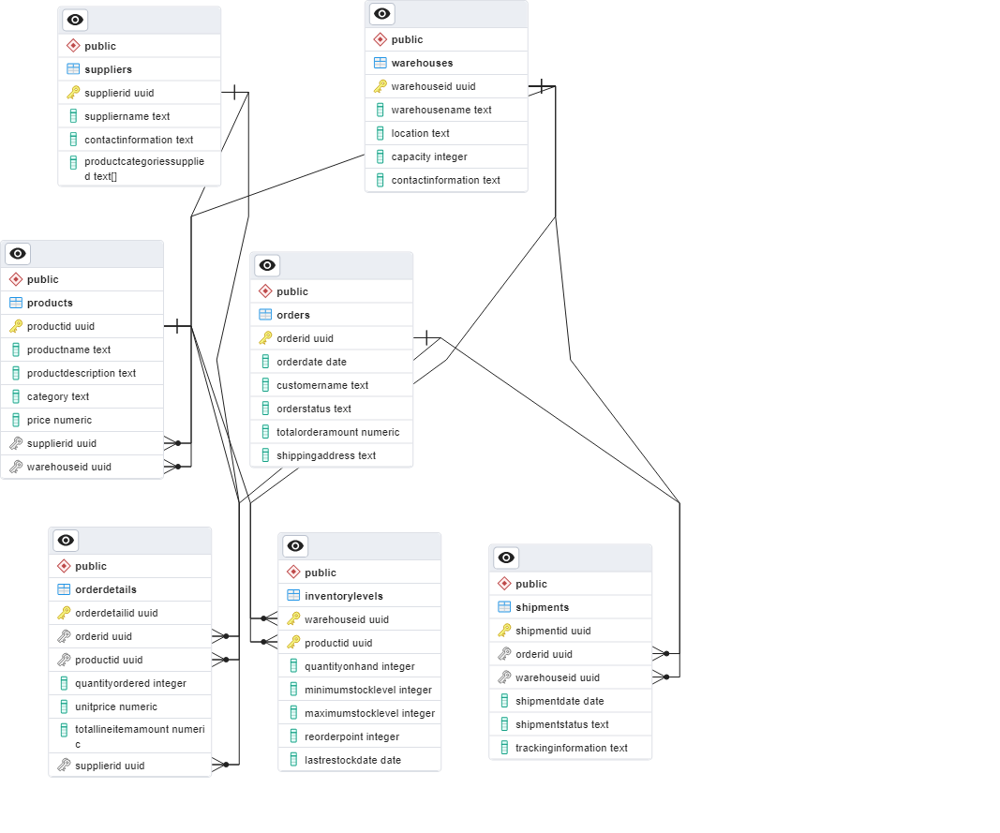
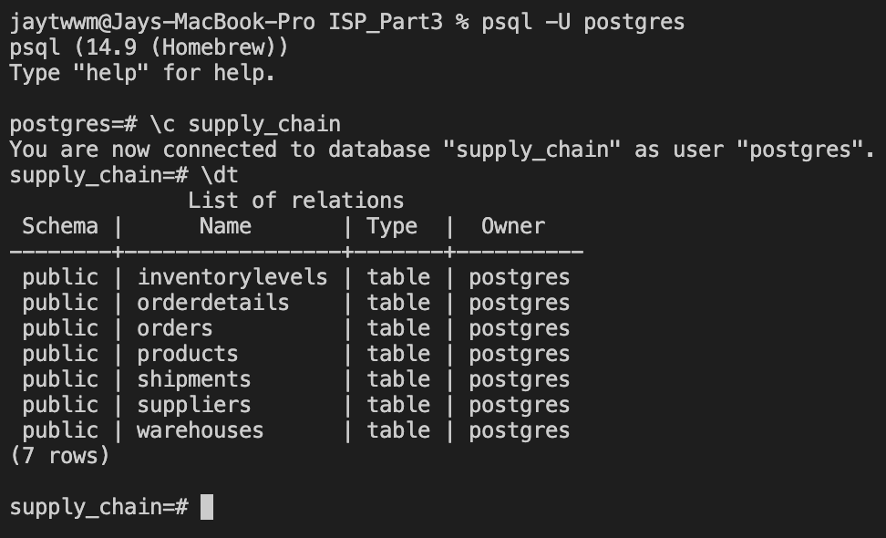
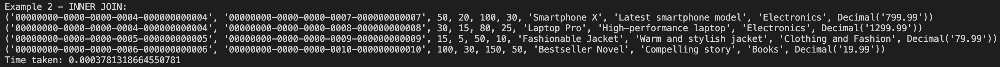
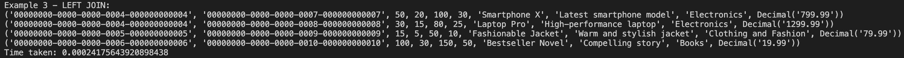
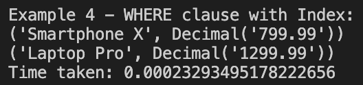
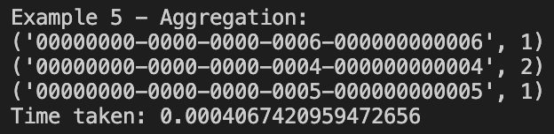
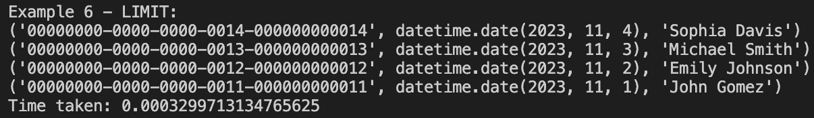
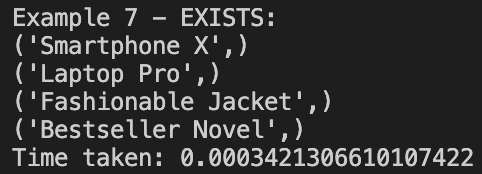

# ISP_Part3

The purpose of this report is to showcase various examples of query optimizations implemented in the `part3.py` file. The examples are based on a supply chain database schema.

## Contents

1. **Python Scripts**: Used for creating the database, connecting to it, executing SQL schema scripts, inserting data, performing database fragmentation, and database replication.

2. **SQL Scripts**: Contains the SQL code for creating tables (`main_schema.sql`) and inserting sample data (`insert_data.sql`). These tables include Products, Warehouses, Suppliers, Orders, OrderDetails, Shipments, and InventoryLevels.

## Setup and Execution

### Prerequisites

- Python 3.x
- PostgreSQL Database Server
- psycopg2 library (Python PostgreSQL adapter)

### Installation Steps

1. **Install psycopg2**: This Python library is essential for connecting to and interacting with PostgreSQL databases. Install it using pip:

   ```bash
   pip install psycopg2
   ```

2. **PostgreSQL Server**: Ensure you have PostgreSQL server installed and running on your system.

### How to Use

1. **Clone the Repository**: Clone this repository to your local machine.

2. **Database Creation**: Run the `create_database()` function from the Python script to create a new database for the supply chain management.

3. **Schema Execution**: Execute the `execute_schema_script()` function to create the necessary tables defined in the `main_schema.sql`.

4. **Data Insertion**: Use the `execute_insert_script()` function to insert sample data into the database from `insert_data.sql`.

5. **Example Query**: Use the `example_query()` function to run an example query and results along with the time taken for the query to run.

## Database Structure


### Tables

- **Products**: Stores information about the products.
- **Warehouses**: Information about warehouses.
- **Suppliers**: Details of suppliers.
- **Orders**: Customer orders.
- **OrderDetails**: Details of each order.
- **Shipments**: Information about product shipments.
- **InventoryLevels**: Inventory levels in each warehouse.

### Database Schema


### PostgreSQL Connection


## Examples and Optimizations:

1. **Creating Index on ProductID:**
   - **Objective:** Improve retrieval speed for queries involving the `ProductID` column in the `InventoryLevels` table.
   - **Implementation:** Created an index named `idx_inventory_product_id` on the `ProductID` column.

   

2. **INNER JOIN Optimization:**
   - **Objective:** Retrieve inventory levels along with product details.
   - **Implementation:** Utilized INNER JOIN between the `InventoryLevels` and `Products` tables.

   

3. **LEFT JOIN Optimization:**
   - **Objective:** Retrieve inventory levels with or without corresponding product details.
   - **Implementation:** Utilized LEFT JOIN between the `InventoryLevels` and `Products` tables.

   

4. **WHERE Clause with Index:**
   - **Objective:** Optimize queries filtering by a specific category in the `Products` table.
   - **Implementation:** Used a WHERE clause with an index on the `Category` column.

   

5. **Aggregation Optimization:**
   - **Objective:** Count the total number of products in each warehouse.
   - **Implementation:** Utilized the GROUP BY clause for aggregation.

   

6. **LIMIT Clause Optimization:**
   - **Objective:** Retrieve a limited number of recent orders.
   - **Implementation:** Used the LIMIT clause in combination with ORDER BY to limit query results.

   

7. **EXISTS Clause Optimization:**
   - **Objective:** Retrieve product names for products existing in the `InventoryLevels` table.
   - **Implementation:** Used the EXISTS clause to check for the existence of related records.

   

## Conclusion:
The provided examples demonstrate various query optimization techniques, including indexing, joining tables, using WHERE clauses with indexes, aggregation, limiting results, and checking for existence. These optimizations aim to enhance the speed and efficiency of real-time inventory tracking and supply chain analysis queries.

## Future Considerations:
Continued optimization efforts may involve periodic analysis of query execution plans using the `EXPLAIN` statement to identify potential areas for improvement. Additionally, regular monitoring and profiling of database performance can guide further optimization strategies based on evolving data patterns and query requirements.

This report provides a foundation for optimizing queries in the supply chain database, and further enhancements can be tailored based on specific use cases and evolving business needs.
